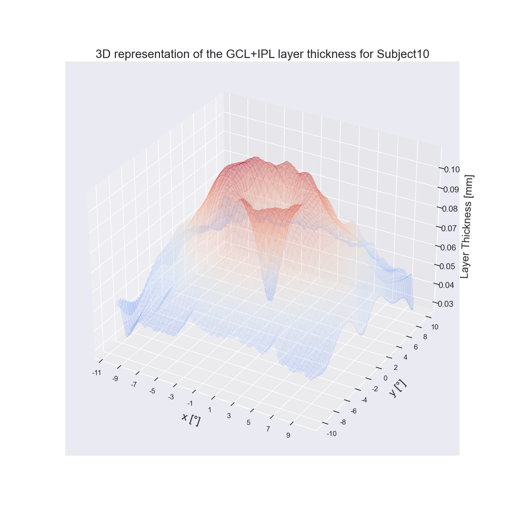
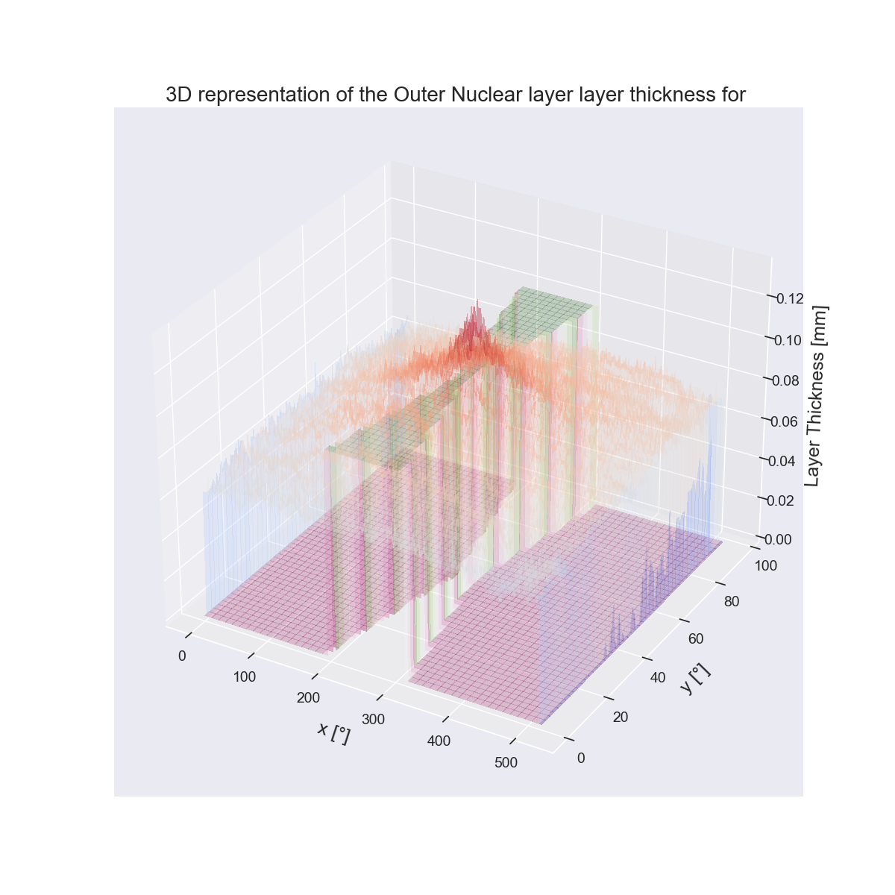
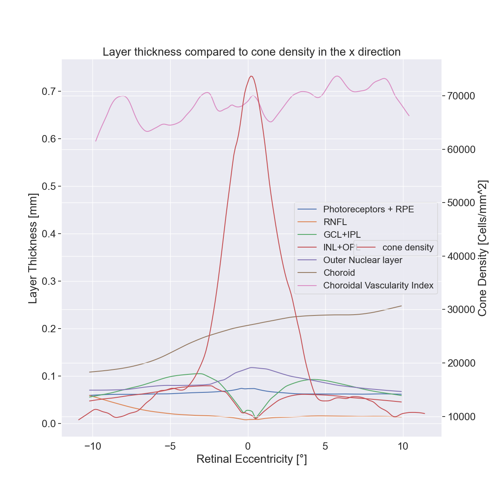

# Layer Thickness step

This step allows to get the different OCT's layer thicknesses of subjects and compare them to their cone densities.

## Parameters explanation

1. **Layer Thickness Directory**: The name of the directory where the layer thickness results and plots will be outputed.

## Parameters from other steps that matters when computing Density estimates

You need to have completed the Density Analysis for subjects you want to compare the layer thicknesses, as well as run the script to get layer thicknesses from raw discovery data (see below)

## Run the montaging step

1. Run via the **InputGUI**: Go to the specific directory via: `cd aoslo_pipeline/src/InputGUI` And run: `python main.py`. Then make sure the tickbox **Do Layer Thickness** is checked, that you have specified the parameters you want in the **LAYER THICKNESS** subsection and that you have selected the correct input folder. Then just press the **Run pipeline!** and follow the instructions.

2. Run via the *config.txt*:Write in the config file that can be found in *aoslo_pipeline/src/PostProc_Pipe/Configs/config.txt* the specific parameters that you want to run, especially everything under the [LayerThickness] section (*__do_compare_to_layer_thickness* must be set to **True** to run this step of the pipeline). Then go to the specific folder: `cd aoslo_pipeline/src/PostProc_Pipe` and run `python Start_PostProc_Pipe.py`.

## Substeps of Layer Thickness

### SCRIPT TO RUN BEFORE ANALYZING LAYER THICKNESSES IN THE PIPELINE

To have layer thicknesses from discovery, you first need to ask whoever is in charge of the Discovery Cohort Builder (Sepher) to extract Subjects you need from discovery (in AOSLO Healthy Patients) adn run the layer thickness algorithm that is able to get the different layer thicknesses from OCTs. Then, you need to specify the input folder (where the given "browsed.json" file is), the output folder (base directory of the subjects to analyze) in the *save_layer_thicknesses.py* file. Once done, run `python save_layer_thicknesses.py`. It will save you all the informations needed in the correct folders to then analyze layer thicknesses.

### Once done, you can run the substeps of layer thicknesses

1. Get the layer thicknesses from the JSON objects (*layer_thickness.json* and *layer_cvis.json*) and create a 3D plot from it.

2. From the very center of the eye (defined in the layer thicknesses by the poisiton of the center peak in the Photoreceptors+RPE layer), gather layer thicknesses values as the mean of the layer thicknesses at a certain distance (defined the same as in when we are getting the distributions of densities with *growing_factor* curve). You can choose to plot the "triangle" that is used to get the layer thicknesses as below.

3. Compare each of the layer thickness to the density for common indices and compute the Spearman correlation between them, separated in different regions (0 to center and center to end for layer that have a single peak (almost all), and 0 to first peak, first peak to center, center to second peak and second peak to end for layers with two peaks and hole in the center ("GCL+IPL", "INL+OPL")   ).

