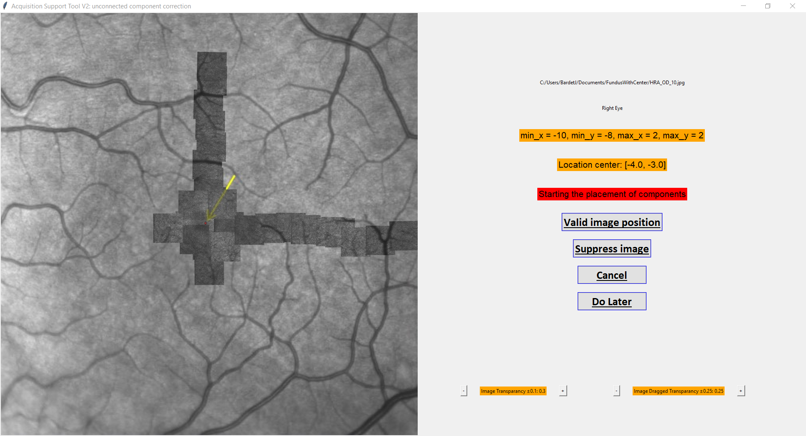

# Montaging step

This step allows to reconstruct the retina's mosaique from single images thanks to their known location on the eye.

## Parameters explanation

1. **Is GUI Done**: Whether or not the GUI has already been done in this patient. If yes, there should be a file that has the same name as the **GUI location file** parameter (if the code cannot find the file it is maybe because you have renamed it. Please keep the GUI location file to be *locations.csv*). **WARNING**: If the GUI has not been done, the pipeline will only run atlab's Montaging step (see below) and stop once it is done. It will allow you to correct the Montaging with the Montaging GUI, modify *is_gui_done* to **True** and restart the pipeline so that the subsequent steps will be runned.

2. **GUI location file**: The name of the file that is saved once the montaging GUI has been terminated. This file should be located in the **Montaging Directory Name** (*montaged*) of the specific subject (e.g. Subject10/Session279/montaged/locations.csv)

3. **Do SSIM correction**: Whether or not we want to correct the output of the GUI. Indeed, when you use the montaging GUI, it is hard to place exactly correctly the unconnected components and thus we correct those small precision error by applying an algorithm (SSIM = Structural Similarity Index) that look for the best overlap between the components.

4. **SSIM n**: The number of pixels we want to search around to find the best overlap between unconnected components. The bigger this number is the longer it will take to find the best overlap. We set this at 36 pixels so that it covers 10% of the image shape (36 pixels in each direction -> 72 pixels)

5. **Run SSIM parallel**: Whether or not we want to run the SSIM algorithm in parallel. If yes, the algorithm will use all the CPU available making the use of the computer slower for other tasks. If you don't need to use your computer for other tasks, validate this option otherwise don't.

6. **Montaging Directory Name**: The name of the directory where Matlab's montaging will be found (default *montaged*), as well as the file where are written the results of the correction of unconnected component with the montaging GUI.

7. **Corrected Montage Directory Name**: The name of the folder where the images corrected with help of the montaging GUI and the SSIM (if choosen) will be found. This is also the directory where the images will be taken for the subsequent analyses, so if you don't correct unconnected components with help of the GUI, specify this folder to be the same as the **Montaging Directory Name**. If you correct with the montaging GUI, write an other directory name please.

8. **SSIM Directory Name**: Name of the directory where the results of the SSIM algorithm will be found. It will also contain the previous (before applying SSIM correction) results of the Montaging Corrected images in a specific folder.

## Run the montaging step

1. Run via the *config.txt*:Write in the config file that can be found in *aoslo_pipeline/src/PostProc_Pipe/Configs/config.txt* the specific parameters that you want to run, especially everything under the [Montaging] section (*__do_montaging* must be set to **True** to run this step of the pipeline). Then go to the specific folder: `cd aoslo_pipeline/src/PostProc_Pipe` and run `python Start_PostProc_Pipe.py`.

## Substeps of Montaging

1. Single images are analyzed in order to find their relative eye location with help of the tags that they have in their name (e.g. _(0,-1)). Then the image name and their location is written in an CSV file and saved in a specific folder for subsequent steps.

Locs file created before Matlab's montaging:

2. A Matlab script (Chen et al.) is then run via the [MATLAB Runtime](https://www.mathworks.com/products/compiler/matlab-runtime.html) so that we don't need to have a valid Matlab license to run the Montage code. If you want to modify the code for the Matlab Montage you can laways open and modify the code in Matlab and then re-create a python package with the modified code by following instruction on this [link](https://www.mathworks.com/help/compiler_sdk/gs/create-a-python-application-with-matlab-code.html). At this step if an error occurs, verify that you have the correct Matlab Runtime version installed (R2022a (9.12)). If the error persists you may need to investigate the csv file that Matlab's code use or the code itself. There is also a [README](./AOAutomontaging_master/README.pdf) to run the code from Matlab.

Matlab's montaging results:

**WARNING** The pipeline will stop here (unless is_gui_done is set to True) so that you will be able to correct the montage with the Montaging GUI script. If multiple subjects have been selected, it will process subjects one by one until the end of this step. Then you will have to restart the pipeline with is_gui_done set to True to continue with the analysis.

3. If you want to correct the results of Matlab's montaging and replace the unconnected components with help of the subject's fundus image you can run the Montaging GUI either from the InputGUI by clicking on **MontagingGUI** or from the command line by executing the code `python main.py`in the specific folder *aoslo_pipeline/src/PostProc_Pipe/Montaging/AST_v2*. You can find all the documentation about how to correct the GUI results in the preisouly cited folder in the [README file](../Montaging/AST_v2/README.pdf). There's an additional GUI similar to AST_V2 but for fixed image size. 

Example of Montaging's GUI:

4. Then the code will gather results from the Montaging GUI and recompute the corrected location of each image regarding its component and the total image size. It will then save each image's shift relative to the upper left corner of the image and save the image in its relative shifts and a total image with all shifted images (*Confocal.tif* and *Confocal_center.tif* same but with center depicted in a big white circle).

Example of Corrected Montage with the center in white:

5. Once done you can choose whether you want to apply SSIM correction and specify on how many pixels you want to search for the best alignment between unconnected components. This step has been created because when the doctor will place the components on the fundus image, there will always be an approximation error due to the fact that a small mouse movement induce a big displacement as images are small on the fundus. Thus this algorithm search in the neighboring positions around the location where the doctor placed the image in order to find whether there is a location with the highest SSIM score that would correspond to the best alignement between neighboring components.

Example of SSIM correction before (left) and after (right) applying the algorithm:

## Considerations about this step

### Make sure you use all modalities to run Matlab's code

Matlab's montaging works better when we feed it images from Confocal, CalculatedSplit and DarkField images so make sure you have all those madalities file in your folder.

### Do not trust Matlab's output

Matlab's code for montaging outputs images with the images well placed inside components but components (by component I mean multiple connected images that overlap) are misplaced. That is why we have to use a GUI to correct this. Also, one of the ouptut is a *.mat* file where we have the transform of each image. THOSE TRANSFORMS ARE WRONG, don't trust those but use the homemade *create_own_shifts* function in *global_helpers.py* in order to recover the correct shifts of all images.

### Always verify the Corrected results

The Montaging Correction step does not handle every corner case for weird montagin (that should not happen). Make sure the results look like what you want, modify the code otherwise!

## Deeper Explanation of the Maths behind the Montaging step

The video to image registration pipeline (under Input_Data_Pipe) outputs images in Tag Image File Format TIF, with file names containing the subject number, the image capturing session number, whether it is the left or right eye, their pixel width, their location tag and their respective modality. Images have a size of 720 pixels and capture 1.5 degrees (in width and height) of the subject’s retina. As they are captured at each 1.0 degree, they are supposed to overlap (although this in practice depends on the ability of the subject to fixate consistently during image capture). This allowed me to find the overlap between images captured at neighboring locations, to combine images and better align them with their global location on the retina. This step is referred to as montaging and aims to find the alignment transformation between neighboring images. I used the overlapping condition in combination with the location tag in the filename to reconstruct the global, montaged image.
To performthe montaging, I used a combination of SIFT keypoint detection and RANSAC, to match keypoints and estimate the aligning transformation between tiles. I also exploited the availability of multiple AOSLO imaging modalities. Notably, accuracy is increased by using multiple modalities (Confocal, CalculatedSplit, DarkField) where the sets of matching keypoint pairs are calculated separately for each modality. The RANSAC score is able to integrate the scores from single modalities by summing them, thus returning the best matches across all modalities. This montaging technique allows producing highly accurate montage [1].
The SIFT montaging code [1] had been written in MATLAB and as we did not want to port it to Python, I integrated into the pipeline a call to an AutoIt v3 script that runs a newWindows Power Automate process: this process invokes the MATLAB code that opens a GUI where the automated process fills automatically the files needed for montage and gathers the output once the montaging is done.
The technique discussed above, could not register neighboring images that did not overlap. This potentially led to the creation of multiple connected components that were not correctly located with respect to each other. To address this issue, I created a python script that corrected the image affine transforms of each component resulting ofMatlab’s montage in order to take into account the location tag present in the filename.

[1] Min Chen, Robert F Cooper, Grace K Han, James Gee,David H Brainard, and Jessica IWMorgan. “Multi-modal automatic montaging of adaptive optics retinal images”. In: Biomedical Optics Express 7.12 (2016), pp. 4899–4918.

### SIFT

SIFT (Scale Invariant Feature Transform) [2] is a state-of-the-art technique for feature detection. The algorithm does comprise of four main steps that aim to find keypoints
in two images that represent neighborhood location in space:

1. Scale-space peak selection: allows determining the potential location for finding features, by Gaussian blurring the images at different scales of magnification. On the differently blurred images, a difference of Gaussian (DOG) kernel is applied by subtracting images obtained with different σ, for every scale. Keypoints can be found on the resulting images by computing the Laplacian of scale invariant
Gaussian approximations.

2. Keypoint Localization: as multiple keypoints from the previous step are found, the spurious ones (i.e. lying along edges, without enough contrast) have to be discarded. This is particularly needed, as DOG is sensitive to edges. Notably, Taylor series expansion of scale space is used to get a more accurate location of extrema by comparing the extrema’s intensity to an arbitrary threshold t = 0.03.

3. Orientation Assignment. rotation invariance between input and output is imposed by creating keypoints with the same location and scale, but in different directions, thus contributing to the stability of matching.

4. Keypoint descriptor: describing the keypoints as a high dimensional that is highly distinctive and as invariant as possible to variations such as changes in viewpoint and illumination with information from keypoints’ locations, scales and orientations.

By using SIFT for montaging (see Results 4.1), accuracy is prioritized compared to computational power and time with techniques such as Oriented FAST and Rotated BRIEF (ORB) features [3]. Indeed ORB algorithm works similarly to SIFT and tries to locate pixel-level keypoints and match the repeatable key points over the surrounding images where a geometric transformation is estimated. But even though being almost two orders of magnitude faster than SIFT, it is performing worst in most scenarios [4].

[2] G Lowe. “Sift-the scale invariant feature transform”. In: Int. J 2.91-110 (2004), p. 2.
[3] Benjamin Davidson, Angelos Kalitzeos, Joseph Carroll, Alfredo Dubra, Sebastien Ourselin,MichelMichaelides, and Christos Bergeles. “Fast adaptive optics scanning light ophthalmoscope retinal montaging”. In: Biomedical Optics Express 9.9 (2018), p. 4317. I S SN: 2156-7085. DOI: 10.1364/boe.9.004317.
[4] Ebrahim Karami, Siva Prasad, andMohamed Shehata. “Image matching using SIFT, SURF, BRIEF and ORB: performance comparison for distorted images”. In: arXiv preprint arXiv:1710.02726 (2017).

### RANSAC

Random Sample Consensus (RANSAC) [5] is an algorithm to estimate the parameters of a mathematical model which is robust to outliers. In image analysis, it is employed to estimate the aligning transformation between keypoints and assess the quality of the transformation while ignoring outliers in features detected by algorithms such as SIFT. To this end, RANSAC takes random subsets of matched feature pairs used to estimate the transformation T. T is then applied to all SIFT matches and the sum of the squared error is calculated between feature location in one image and transformed feature location in the other. At the end, the candidate transformation that maximizes the number of features fitting the transformation is taken.

[5] Martin A Fischler and Robert C Bolles. “Random sample consensus: a paradigm for model fitting with applications to image analysis and automated cartography”. In: Communications of the ACM 24.6 (1981), pp. 381–395.

### SSIM

The Structural Similarity Index (SSIM) [6] is a metric to measure the similarity between two given images based on the degradation of structural information, instead of looking at each pixel’s correspondence.  Thus, SSIM compares the structure, the contrast and the luminosity between given images, and is ranging from -1 to 1, where 1 indicates that the two images are similar.

[6] Zhou Wang, Alan C Bovik, Hamid R Sheikh, and Eero P Simoncelli. “Image quality assessment: from error visibility to structural similarity”. In: IEEE transactions on image processing 13.4 (2004), pp. 600–612.
